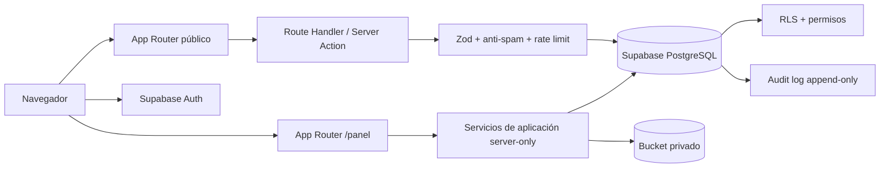

# Arquitectura maestra KNV

## Alcance de Fase 0

Esta fase crea exclusivamente la fundación técnica del sitio público y el CRM jurídico privado. La página raíz, el acceso y el panel existentes son shells de verificación; no son módulos funcionales ni diseños finales.

## Estado inicial auditado

- La carpeta `Karla_Vasquez` estaba vacía.
- Git se resolvía accidentalmente al repositorio padre `Kenneth_Projects`, sin commits y con un remoto perteneciente a `kencodehn`.
- No había `package.json`, lockfile, código, variables de entorno ni assets locales.
- Los mockups y logotipos fueron suministrados como referencias en la conversación, no como archivos editables del repositorio.
- Se inicializó un repositorio Git aislado en esta carpeta para no tocar proyectos vecinos.

## Principios

1. PostgreSQL es la fuente de verdad para integridad, autorización y trazabilidad.
2. La UI nunca se considera una barrera de seguridad.
3. Los Server Components son la opción predeterminada; los Client Components se reservan para interacción local.
4. Todas las mutaciones validan entrada, sesión y permiso en servidor.
5. El sitio público y el CRM comparten dominio de negocio, tipos y tokens, pero tienen layouts y límites de caché distintos.
6. La relación canónica es `consultation → client → cases[]`; un cliente no se limita a un expediente.
7. Los documentos jurídicos permanecen privados y se entregan mediante URLs firmadas de corta duración.

## Vista general



## Capas

### Presentación

- `src/app`: rutas, layouts, metadata, límites de carga/error.
- `src/components/ui`: primitivas accesibles, sin reglas de negocio.
- `src/components/public`, `src/components/crm`, `src/components/forms`: composiciones futuras por superficie.

### Aplicación

- `src/features/<feature>`: consultas, clientes, expedientes, documentos, agenda y CMS.
- Cada feature contendrá validación, queries, commands, mappers y componentes específicos.
- Las páginas solo orquestan; no contendrán transacciones ni lógica de autorización.

### Infraestructura

- `src/lib/supabase`: clientes browser, server y service-role separados.
- `src/lib/permissions`: vocabulario y verificaciones de permisos.
- `src/lib/validation`: esquemas compartidos.
- `src/lib/security`: rate limiting, uploads, logging seguro e idempotencia en fases siguientes.

## Server vs. client

| Responsabilidad              | Ejecución                                          |
| ---------------------------- | -------------------------------------------------- |
| Consultas a datos privados   | Server Component o servicio server-only            |
| Verificación de usuario      | `supabase.auth.getUser()` en servidor              |
| Autorización                 | RLS + permiso server-side                          |
| Mutaciones                   | Server Action o Route Handler validado             |
| Formularios interactivos     | Client Component pequeño + React Hook Form         |
| Tablas, filtros y paginación | Query server-side; estado de controles en cliente  |
| Service role                 | Solo módulo `server-only`; nunca en bundle público |
| Creación de signed URL       | Servidor, después de autorizar el documento        |

## Patrón de mutaciones

1. Verificar sesión en servidor.
2. Validar payload con Zod.
3. Verificar permiso explícito.
4. Ejecutar una función SQL transaccional cuando haya múltiples escrituras.
5. Registrar auditoría segura.
6. Invalidar la caché afectada.
7. Devolver un resultado tipado sin detalles internos.

Las operaciones críticas usarán claves de idempotencia. La migración incluye una conversión de consulta a cliente bloqueada con `FOR UPDATE`, que devuelve el mismo cliente ante reintentos.

## Estructura objetivo

```text
src/
  app/
    (public)/                 # sitio público futuro
    (auth)/                   # login y recuperación
    (crm)/panel/              # superficie privada
    api/                      # webhooks o endpoints cuando sean necesarios
  components/
    ui/ public/ crm/ forms/ layout/
  features/
    consultations/ clients/ cases/ documents/
    tasks/ events/ users/ cms/ audit/
  lib/
    auth/ env/ permissions/ security/ supabase/ utils/ validation/
  config/
  types/
supabase/
  migrations/
tests/
  e2e/
docs/
```

Las carpetas se crean cuando exista código real; no se agregan directorios vacíos por apariencia.

## Caché y rendimiento

- Páginas públicas publicadas: renderizado estático o revalidado cuando el contenido lo permita.
- CRM: dinámico y sin caché compartida para datos privados.
- Paginación, búsqueda y filtros se ejecutan en PostgreSQL; nunca se descarga el universo de clientes al navegador.
- Índices cubren búsqueda normalizada, estados, responsables, próximas acciones, fechas y auditoría.
- Imágenes públicas usarán `next/image`; documentos privados no pasarán por optimización pública.

## Manejo de errores

- Errores esperados: resultado tipado y mensaje accionable.
- Permiso denegado: respuesta genérica 403 sin revelar existencia del registro.
- Inesperados: identificador de correlación, log técnico redactado y mensaje público neutro.
- `error.tsx`, `loading.tsx` y `not-found.tsx` establecen los límites globales iniciales.

## Decisiones pendientes de configuración externa

- Crear proyecto Supabase y ejecutar migraciones revisadas.
- Configurar credenciales Auth, URL canónica y remitente de correo.
- Definir proveedor de rate limit y protección anti-bot.
- Recibir logo/imaginería en archivos fuente y datos reales aprobados del bufete.
