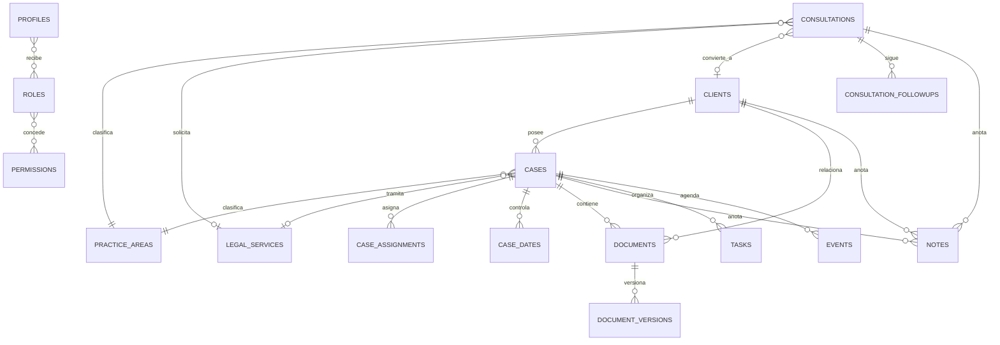

# Diseño de base de datos

## Relación fundamental

`consultations.converted_client_id` preserva la trazabilidad. `clients.source_consultation_id` identifica la consulta de origen. Otras consultas históricas pueden apuntar al mismo cliente. `cases.client_id` permite cero, uno o muchos expedientes por cliente a lo largo del tiempo.

## Grupos de entidades

| Dominio              | Entidades                                                            |
| -------------------- | -------------------------------------------------------------------- |
| Acceso               | `profiles`, `roles`, `permissions`, `role_permissions`, `user_roles` |
| Catálogo             | `practice_areas`, `legal_services`, estados configurables            |
| Consultas            | `consultations`, historial, seguimientos                             |
| Clientes             | `clients`, contactos, etiquetas, relaciones                          |
| Expedientes          | `cases`, historial, asignaciones, fechas, contactos                  |
| Conocimiento privado | `notes`, `documents`, versiones, accesos                             |
| Productividad        | `tasks`, `events`, `reminders`, `contact_logs`, `notifications`      |
| Gobierno             | `audit_logs`, configuraciones, preferencias                          |
| CMS                  | áreas, servicios, artículos, categorías, páginas y settings          |
| Intake               | `contact_submissions` y `consultations` vía endpoint server-side     |

## Decisiones de normalización

- Las notas se consolidan en `notes` con exactamente un padre. Esto evita tres tablas casi idénticas y mantiene FKs reales mediante un `CHECK`.
- Estados de consultas y expedientes son lookup tables porque deben poder ordenarse, desactivarse y presentarse con tokens visuales. Prioridades y estados técnicos estables sí usan enums.
- `case_dates` representa hitos/vencimientos del expediente; `events` representa elementos de agenda. Una fecha importante puede originar un evento, pero no se confunden conceptualmente.
- Los documentos separan registro lógico (`documents`) de bytes/versiones (`document_versions`).
- No se impone unicidad a email o teléfono de clientes: varias personas pueden compartirlos. Los índices producen candidatos a duplicado para revisión humana.

## IDs humanos

`human_id_counters` mantiene un contador por entidad y año. `next_human_id()` usa `INSERT ... ON CONFLICT DO UPDATE ... RETURNING`, por lo que PostgreSQL serializa incrementos concurrentes.

- Consulta: `CON-YYYY-0001`
- Cliente: `CLI-YYYY-0001`
- Expediente: `KNV-YYYY-0001`

UUID es la clave interna. Los IDs humanos son únicos, no se calculan contando filas y nunca autorizan por sí mismos.

## Conversión transaccional

`convert_consultation_to_client()`:

1. exige permisos;
2. bloquea la consulta con `FOR UPDATE`;
3. devuelve el cliente ya convertido ante un reintento;
4. crea un cliente nuevo o vincula uno elegido manualmente;
5. actualiza estado y vínculo;
6. registra historial y auditoría dentro de la misma transacción.

La función no fusiona coincidencias automáticamente. La interfaz futura mostrará posibles coincidencias por email/teléfono normalizados y requerirá decisión humana.

## Índices principales

- Consultas: `(status_id, received_at)`, responsable/próxima acción, email, teléfono y GIN trigram de nombre.
- Clientes: email, teléfono y GIN trigram de nombre.
- Expedientes: cliente/estado, responsable/próxima acción y asignaciones activas.
- Productividad: tarea por responsable/estado/vencimiento; eventos por responsable/inicio.
- Auditoría: entidad/fecha y actor/fecha.
- CMS: estado/fecha de publicación.

## Fechas

- Instantes se guardan como `timestamptz` (UTC internamente).
- Fechas verdaderamente civiles usan `date`.
- La zona por defecto es `America/Tegucigalpa` y se conserva en el evento.
- `opened_on` usa la fecha local de Honduras, no la fecha UTC del servidor.

## Borrado y retención

- Clientes, expedientes, notas y documentos se archivan; no desaparecen silenciosamente.
- Historial y auditoría son append-only para roles de aplicación.
- Cascadas solo eliminan hijos operativos cuando el padre se elimina por una operación administrativa excepcional.
- La política final de retención y eliminación legal debe aprobarse antes de producción.

## Migraciones

1. `202609130001_initial_schema.sql`: tablas, constraints, índices, IDs y triggers.
2. `202609130002_authorization_rls.sql`: funciones de autorización, RLS, bucket privado y conversión.
3. `202609130003_reference_data.sql`: roles, permisos, estados, áreas, servicios confirmados y categorías documentales.

Las migraciones no se ejecutaron contra una base externa en Fase 0 porque no se proporcionaron credenciales ni un proyecto Supabase aislado.
