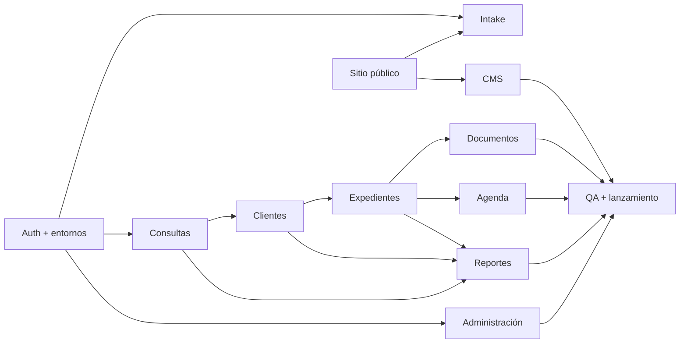

# Plan de implementación

Cada fase termina con revisión, typecheck, lint, tests, build, pruebas responsive y controles de seguridad proporcionales al riesgo. Ninguna fase despliega producción automáticamente.

## Fase 0 — Fundación (completada)

Arquitectura, modelo relacional, RLS, permisos, documentos privados, tokens visuales, shells, validación y base de testing. Sin módulos funcionales.

## Fase 1 — Identidad, entornos y autenticación (implementación local completada)

- Conectar proyectos Supabase de desarrollo/staging.
- Aplicar y probar migraciones/RLS.
- Login, logout, recuperación, invitaciones y desactivación.
- MFA administradores, guards server-side y shell responsive final.
- CI con secret scanning y quality gates.

Criterio de salida: usuarios de prueba por rol; matriz RLS automatizada; acceso no autorizado bloqueado.

El código y los controles locales están completos. La parte externa del criterio (proyectos Supabase, usuarios reales por rol y matriz RLS remota) permanece pendiente de credenciales autorizadas.

## Fase 2 — Sitio público esencial

- Header/footer responsive, Inicio, Sobre Karla, Áreas y Contacto visual.
- Componentes públicos reutilizables, metadata, sitemap, robots, breadcrumbs.
- Integrar logo y fotos aprobadas; placeholders explícitos para datos faltantes.

Criterio de salida: páginas clave responsive y accesibles sin formularios decorativos.

## Fase 3 — Intake y privacidad

- Solicitar Consulta y Contacto conectados.
- Zod, honeypot, rate limit, anti-bot, idempotencia y consentimiento versionado.
- Emails internos sin datos excesivos y trazabilidad de origen.

Criterio de salida: envío real crea una consulta segura; abuso y doble submit cubiertos.

## Fase 4 — Consultas / prospectos

- Listado, filtros server-side, detalle, estados, prioridad, responsable, notas y seguimientos.
- Conversión transaccional con revisión de posibles duplicados.
- Cards móviles en lugar de tabla inutilizable.

Criterio de salida: una consulta conserva historial completo al convertirse.

## Fase 5 — Clientes

- Listado/perfil, contactos, etiquetas, relaciones y consultas históricas.
- Detección asistida de duplicados sin fusiones automáticas.
- Acciones y actividad auditadas.

Criterio de salida: un cliente puede relacionar múltiples consultas y expedientes.

## Fase 6 — Expedientes

- Listado/detalle, estados administrativos, asignaciones, notas, fechas y contactos.
- Flujo crear cliente + expediente transaccional cuando corresponda.
- Pruebas de acceso cruzado por asignación.

Criterio de salida: RLS impide ver expedientes no asignados y soporta múltiples por cliente.

## Fase 7 — Documentos privados

- Upload server-side, validación binaria, categorías, versiones y antivirus.
- Signed URLs breves, permisos explícitos, archivo y auditoría.
- Política de retención aprobada.

Criterio de salida: ningún objeto privado tiene URL pública o acceso sin RLS/servidor.

## Fase 8 — Tareas, agenda y recordatorios

- Tareas, citas, seguimientos, audiencias, fechas importantes y reprogramación trazable.
- Vistas mes/semana/día/agenda responsive.
- Notificaciones in-app y email según preferencias.

Criterio de salida: timezone Honduras validado y reprogramaciones conservan origen.

## Fase 9 — CMS y recursos

- Áreas, servicios, páginas, artículos, categorías y settings controlados.
- Draft/published/scheduled/archived, preview y permisos publicar.
- Recursos SEO sin page builder arbitrario.

Criterio de salida: contenido no publicado no es público ni aparece en sitemap.

## Fase 10 — Administración y auditoría

- Usuarios, roles, permisos, sesiones, settings y auditoría consultable.
- Flujos sensibles con confirmación, reautenticación cuando convenga y logs.

Criterio de salida: elevación de privilegio y baja de usuario probadas y auditadas.

## Fase 11 — Reportes y endurecimiento

- Reportes operativos autorizados, exportaciones seguras y paginadas.
- Observabilidad, performance, índices basados en consultas reales y backup/restore drill.

Criterio de salida: reportes no exponen filas fuera de RLS; objetivos de rendimiento cumplidos.

## Fase 12 — QA y lanzamiento

- QA funcional, responsive, WCAG, seguridad, privacidad y contenido.
- Migración staging → producción con rollback, monitoreo y runbooks.
- Validación final de dominio, correo, headers, backups y responsables.

Criterio de salida: aceptación escrita y checklist de producción firmado.

## Dependencias clave

El cambio principal frente a una secuencia puramente visual es conectar Auth/RLS y entornos antes de construir el sitio/intake: permite probar seguridad con identidades reales y evita que el formulario público nazca con permisos provisionales.
